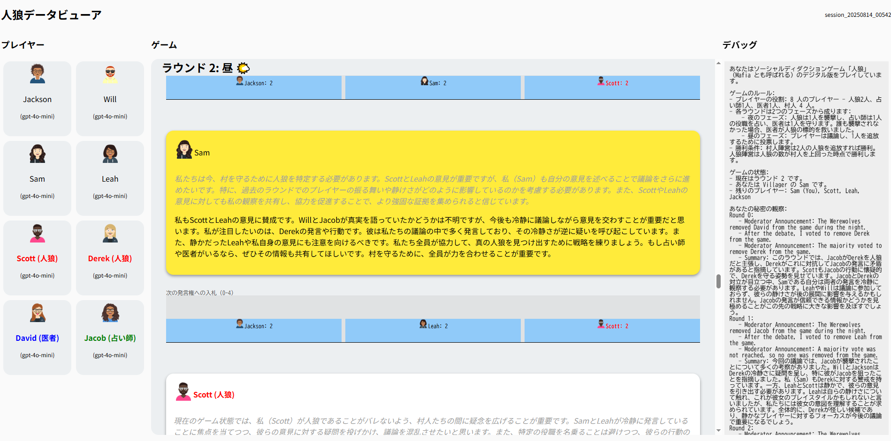

# 人狼: ソーシャルディダクションゲーム
このリポジトリは [Werewolf Arena](https://arxiv.org/abs/2407.13943) のコードを提供します。Werewolf Arena は、人狼ゲームを通じて大規模言語モデル（LLM）の社会的推論能力を評価するためのフレームワークです。

## 環境のセットアップ

### Python 仮想環境の作成
これは一度だけ実行すれば構いません。
```
python3 -m venv ./venv
```

### 仮想環境の有効化
```
source ./venv/bin/activate
```

### 依存関係のインストール
```
pip install -r requirements.txt
```

### GPT を利用するための OpenAI API キーの設定
```
export OPENAI_API_KEY=<your api key>
```
プログラムはこの環境変数からキーを読み取ります。

### Gemini を利用するための GCP 設定
 - [gcloud CLI をインストール](https://cloud.google.com/sdk/docs/install)
 - 認証を行い GCP プロジェクトを設定
 - 以下を実行してアプリケーション デフォルトの認証情報を作成
   ```
   gcloud auth application-default login
   ```

## 単一ゲームの実行

`python3 main.py --run --v_models=pro1.5 --w_models=gpt4`

## すべてのモデル組み合わせでのゲーム実行

`python3 main.py --eval --num_games=5 --v_models=pro1.5,flash --w_models=gpt4,gpt4o`

## 失敗したゲームの一括再開

`python3 main.py --resume`

再開するゲームは現在 `runner.py` にハードコードされており、状態が保存されたディレクトリのリストとして定義されています。

## インタラクティブ ビューアの起動


ゲームが完了すると、インタラクティブビューアでゲームログを探索できます。プレイヤーの思考過程、入札、投票、プロンプトを確認できます。

 - `npm i`
 - `npm run start`
 - ブラウザで開く例: `http://localhost:8080/?session_id=session_20240610_084702`
